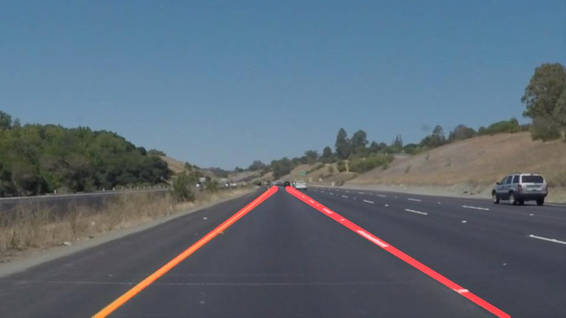

# Finding Lane Lines on the Road using OpenCV
---
**Objectives:**

The goals of this project are the following:

* Detect lane lines on the road from the original image/video
* Highlight the lane-line regions on the output image/video 
* Handle various factors that affect the accuracy of the detector
 

[//]: # (Image References)

[image1]: ./examples/grayscale.jpg "Grayscale"

---

### Reflection:

#### 1. Implementation

My pipeline consisted of 5 main steps following the order below: 

    1. Convert to Grayscale
    2. Perform Gaussian Blur
    3. Perform Canny Edge Detection 
    4. Extract Region Of Interest (ROI)
    5. Perform Hough Lines Detection
    
    Optional (for challenge problem):
    - Pre-processing: Convert yellow lane to white lane for better contrast before applying grayscale 
      (using color masking)
    - Post-processing: Ignore horizontal lines (|slope| > 0.3)  

After obtaining a list of all detected lines (from Hough Line Detection), I performed the following steps to draw one single line on the left and right lanes:

    1. Calculate the slope of each line
    2. Split the list into left-lane list (slope < 0) and right-lane list (slope > 0)
    3. Take the average line coordinate of each list (np.mean)
    4. Extrapolate the left-lane line and right-lane line 

#### 2. Potential Issues

The detector may fail to detect lane lines correctly in many cases, including:

- When the contrast between the road and the lane lines is not significant enough.
- When there are shadows (or other color-distintive objects) inside ROI region.
- Dashed or curvy lane lines.

#### 3. Future Improvements

One future improvement would be applying some brightness and color contrast adjustment in pre-processing step. We can detect yellow and white lane regions using color masking first before converting image to grayscale. In addition, it would be useful if we know the average color of the road. For a line to be a part of right or left lanee, its color must be close to white or yellow, and differ from the average color of the road. 

Another improvement would be applying weighted average for each of the left and right lane (based on previous frames). This would help the display of left and right lane lines a bit more consistent in videos.

